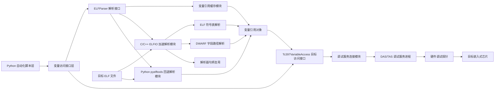
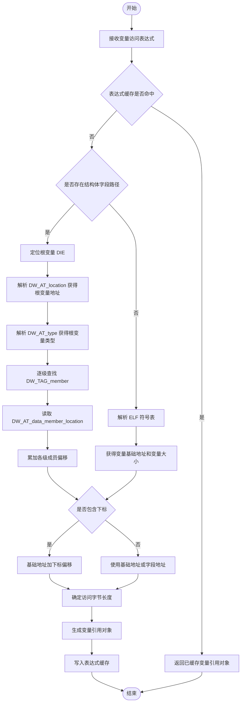
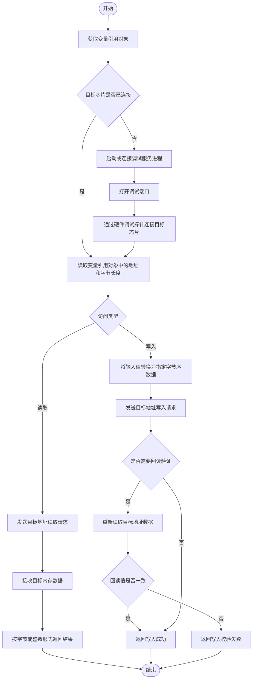

# 发明专利技术交底书初稿

## 一、建议名称

一种基于 Linux 调试接口和 ELF/DWARF 解析的嵌入式目标变量访问方法、装置及存储介质

可选名称：

- 一种面向嵌入式芯片的 ELF 变量名自动解析与调试接口读写方法
- 一种基于调试探针和调试符号解析的嵌入式目标内存自动访问方法
- 一种支持结构体字段路径访问的嵌入式 ELF 变量读写自动化方法

## 二、技术领域

本发明涉及嵌入式软件调试、芯片在线调试、自动化测试和可执行文件符号解析技术领域，尤其涉及一种在 Linux 环境下，基于硬件调试探针、调试服务接口以及 ELF/DWARF 调试信息，实现嵌入式目标芯片变量地址自动解析和变量值读写的方法、装置及计算机可读存储介质。

## 三、背景技术

在汽车电子、工业控制和嵌入式控制器开发过程中，开发人员通常需要对目标芯片中的全局变量、结构体成员、通信信号缓存区或运行状态量进行在线读取和写入，以完成软件调试、自动化测试、故障注入、标定验证或回归测试。

现有技术中，常见方案包括：

1. 通过图形化集成开发环境配置调试工程，并在 IDE 中手工查看变量或表达式；
2. 通过调试器按照绝对地址读写内存；
3. 通过脚本工具读取 ELF 符号表中的简单全局符号，再通过调试接口按地址访问；
4. 借助商业调试工具的私有表达式解析和变量窗口能力完成结构体字段解析。

上述方案存在如下问题：

1. 自动化程度不足。依赖图形化 IDE 工程时，批量测试、持续集成或无界面服务器环境下使用不便。
2. 变量访问粒度受限。仅依靠 ELF 符号表通常只能得到平铺的全局变量，难以直接支持 `结构体变量.成员.子成员`、`变量[index]` 等访问形式。
3. 大型 ELF 文件解析耗时较长。汽车控制器软件的 ELF 文件可能包含数百 MB 调试信息，纯脚本全量解析 DWARF 信息会带来明显延迟。
4. 地址读写与符号解析耦合不清。每次读写变量时重复解析符号或字段路径，造成效率浪费。
5. 工具链适配成本高。不同芯片、调试探针、调试服务和自动化脚本之间缺乏统一封装。

因此，需要一种能够在 Linux 环境中，将 ELF/DWARF 变量解析、结构体字段路径解析、硬件调试接口连接以及目标内存读写进行统一封装的方法，使用户可以通过变量名或结构体字段路径直接访问目标芯片中的变量值。

## 四、发明目的

本发明的目的在于提供一种嵌入式目标变量自动访问方法，使用户能够在 Linux 环境下，通过硬件调试探针连接目标芯片，并根据 ELF 文件中的符号表和 DWARF 调试信息，将变量名、数组下标表达式和结构体字段路径自动解析为目标芯片内存地址及访问字节长度，再通过调试接口完成目标内存读写。

本发明进一步目的在于：

1. 支持 `变量名`、`变量名[index]`、`结构体变量.字段.子字段` 等表达式；
2. 避免对特定图形化调试工程的强依赖；
3. 通过 C/C++ 解析模块提高大型 ELF/DWARF 文件的解析效率；
4. 将解析结果缓存为变量引用对象，读写时直接使用地址和字节长度；
5. 为 Python 等脚本语言提供统一接口，以便自动化测试系统调用。

## 五、技术方案

本发明提供一种基于 Linux 调试接口和 ELF/DWARF 解析的嵌入式目标变量访问方法，包括如下步骤：

1. 在 Linux 环境中启动或连接调试服务进程，所述调试服务进程用于与硬件调试探针通信；
2. 通过硬件调试探针建立与目标嵌入式芯片的调试连接；
3. 加载目标软件对应的 ELF 文件；
4. 解析 ELF 文件中的符号表，获得全局变量或静态变量的名称、地址、大小、绑定属性和所在段信息；
5. 解析 ELF 文件中的 DWARF 调试信息，获得变量类型、结构体成员、成员偏移、成员大小、数据类型符号和变量存储地址；
6. 接收变量访问表达式，并将所述表达式解析为变量引用对象；
7. 所述变量引用对象至少包括目标地址、访问字节长度、基础变量名称、变量类型信息和符号来源信息；
8. 根据变量引用对象中的目标地址和访问字节长度，通过调试服务接口向目标芯片发送内存读请求或内存写请求；
9. 返回读取结果，或在写入后执行可选的回读验证。

其中，变量访问表达式可以包括：

- 简单变量表达式，例如 `kWireToFsmRspaData`；
- 字节下标表达式，例如 `kWireToFsmRspaData[128]`；
- 结构体字段表达式，例如 `kAdapterReadSignalDoc.flexray.VehModMngtGlbSafe1UsgModSts`；
- 结构体字段下标表达式，例如 `someStruct.member.buffer[3]`。

## 六、关键技术点

### 6.1 调试接口连接模块

调试接口连接模块用于在 Linux 环境下连接调试服务进程，并通过调试服务进程使用硬件调试探针访问目标芯片。

在一种实施方式中，硬件调试探针可以为 DAP Wiggler、DAS JDS 或其他兼容调试探针。调试服务接口可以为 DAS/TAS 类接口，也可以为其他支持目标地址读写的调试服务接口。

该模块提供：

1. 初始化调试服务；
2. 连接目标芯片；
3. 按目标地址读取指定字节数；
4. 按目标地址写入指定字节数；
5. 断开目标芯片连接。

### 6.2 ELF 符号表解析模块

ELF 符号表解析模块用于读取 ELF 文件中的符号表 section，例如 `.symtab` 或 `.dynsym`，并筛选对象类符号。

解析结果包括：

1. 符号名称；
2. 符号地址；
3. 符号大小；
4. 符号类型；
5. 绑定属性；
6. 所在 section 名称。

该模块用于处理简单变量名和带字节下标的变量表达式。

### 6.3 DWARF 字段路径解析模块

DWARF 字段路径解析模块用于处理结构体字段路径。

对于表达式：

```text
kAdapterReadSignalDoc.flexray.VehModMngtGlbSafe1UsgModSts
```

该模块执行如下处理：

1. 识别根变量 `kAdapterReadSignalDoc`；
2. 在 DWARF 调试信息中定位该根变量的 DIE；
3. 读取根变量的 `DW_AT_location`，得到根变量地址；
4. 读取根变量的 `DW_AT_type`，获得结构体类型 DIE；
5. 在结构体类型 DIE 的成员中查找 `flexray`；
6. 读取 `flexray` 成员的 `DW_AT_data_member_location`，获得第一层偏移；
7. 继续进入 `flexray` 的结构体类型 DIE；
8. 查找成员 `VehModMngtGlbSafe1UsgModSts`；
9. 读取该成员偏移和字节大小；
10. 将根变量地址与各级成员偏移累加，得到最终目标地址。

例如：

```text
根变量地址 = 0x600237b4
flexray 偏移 = 0x000
VehModMngtGlbSafe1UsgModSts 偏移 = 0x1c0
最终地址 = 0x600237b4 + 0x000 + 0x1c0 = 0x60023974
```

### 6.4 变量引用对象

变量引用对象用于缓存一次表达式解析结果。该对象至少包含：

1. 原始表达式；
2. 基础变量名；
3. 目标地址；
4. 默认访问字节数；
5. 基础变量大小；
6. 是否为下标访问；
7. 是否有符号；
8. 来源信息，例如符号表或 DWARF 字段；
9. 类型名称。

在后续读写时，系统不再重复解析 ELF 或 DWARF，而是直接根据变量引用对象中的地址和字节数访问目标芯片。

### 6.5 C/C++ 加速解析模块

在一种实施方式中，系统使用 C/C++ 编写 ELF/DWARF 解析模块，并通过 Python 的 ctypes、Python 扩展模块或其他 FFI 机制向脚本层暴露接口。

C/C++ 模块可以使用 ELFIO 读取 ELF 容器和符号表，并实现 DWARF 子集解析逻辑，以支持结构体字段路径解析。解析模块可以在打开 ELF 后保持解析器句柄，使多个变量表达式共享同一个 ELF 读取上下文和 DWARF 缓存。

### 6.6 Python 自动化接口

Python 自动化接口用于封装 C/C++ 解析模块和调试接口连接模块。用户可以通过如下方式使用：

```python
elf = ElfParser("MCU_A_0527.elf", include_zero_size=True)
ref = elf.get_variable_reference(
    "kAdapterReadSignalDoc.flexray.VehModMngtGlbSafe1UsgModSts"
)

with Tc397VariableAccess("MCU_A_0527.elf", elf_parser=elf) as target:
    value = target.read_reference_value(ref)
    target.write_reference(ref, 0x12)
```

## 七、有益效果

与现有技术相比，本发明至少具有如下有益效果：

1. 提高自动化能力。用户可在 Linux 脚本环境下完成目标变量读写，便于持续集成和自动化测试。
2. 降低使用复杂度。用户无需手工查找地址，只需输入 ELF 中的变量名或结构体字段路径。
3. 支持结构体字段访问。能够解析 DWARF 类型信息，将多级字段路径自动映射为目标地址。
4. 支持字节级访问。可以通过 `变量[index]` 形式访问变量内部指定字节。
5. 提高解析效率。通过 C/C++ 解析模块、解析器句柄复用和变量引用缓存，减少大型 ELF 文件重复解析开销。
6. 提高接口一致性。将符号解析、字段解析、目标连接、地址读写封装为统一接口。
7. 提高可移植性。调试接口可以适配不同硬件调试探针或调试服务，只要其支持目标地址读写。

## 八、附图

### 图1 系统架构图



图1示出了本发明系统的总体架构。Python 自动化脚本层通过变量访问接口层调用 ELF/DWARF 解析接口和目标访问接口；解析接口将变量访问表达式转换为变量引用对象；目标访问接口根据变量引用对象中的地址和字节数，通过调试服务进程、硬件调试探针访问目标嵌入式芯片。

### 图2 变量表达式解析流程图



图2示出了变量访问表达式的解析流程。对于简单变量，系统通过 ELF 符号表获得基础地址和大小；对于结构体字段路径，系统通过 DWARF 调试信息逐级解析成员偏移；对于带下标表达式，系统在基础地址或字段地址上叠加下标偏移。

### 图3 目标变量读写流程图



图3示出了目标变量读写流程。系统在获得变量引用对象后，不再重复解析 ELF 或 DWARF，而是直接使用目标地址和访问字节长度，通过调试服务接口完成读取、写入和可选回读验证。

### 图4 DWARF 多级结构体字段偏移计算示意图


图4示出了 DWARF 多级结构体字段路径的地址计算过程。系统先获得根变量地址，再逐级读取结构体成员偏移，将根变量地址与成员偏移累加，得到最终目标地址和访问字节长度。

### 图5 解析器句柄复用与缓存机制图

```mermaid
flowchart TD
    A[创建 ElfParser 对象] --> B{C/C++ 解析器句柄是否存在}
    B -- 否 --> C[加载 ELF 文件]
    C --> D[创建 C/C++ 解析器句柄]
    D --> E[建立 DWARF CU 索引]
    E --> F[等待变量表达式解析请求]

    B -- 是 --> F
    F --> G{表达式缓存是否命中}
    G -- 是 --> H[直接返回变量引用对象]
    G -- 否 --> I[调用 C/C++ 解析器句柄]
    I --> J{根变量 DIE 缓存是否命中}
    J -- 是 --> K[复用根变量 DIE]
    J -- 否 --> L[按名称定位根变量 DIE]
    L --> M[写入根变量 DIE 缓存]
    M --> N[解析字段路径或符号表]
    K --> N
    <!-- N --> O[生成变量引用对象] -->
    O --> P[写入表达式缓存]
    P --> H
```

图5示出了本发明的解析器句柄复用与缓存机制。对于同一 ELF 文件，系统复用 C/C++ 解析器句柄，并通过表达式缓存、DWARF 编译单元缓存和变量 DIE 缓存减少重复解析开销。

## 九、具体实施方式

### 实施例一：简单全局变量访问

系统加载目标 ELF 文件，从符号表中查找变量 `kWireToFsmRspaData`，获得其地址 `0x600228c4` 和大小 `512` 字节。

当用户输入：

```text
kWireToFsmRspaData[1]
```

系统识别下标 `1`，将目标地址计算为：

```text
0x600228c4 + 1 = 0x600228c5
```

默认访问字节数为 `1`，随后通过调试接口读取或写入该地址。

### 实施例二：结构体字段路径访问

系统加载目标 ELF 文件，并读取 DWARF 调试信息。当用户输入：

```text
kAdapterReadSignalDoc.flexray.VehModMngtGlbSafe1UsgModSts
```

系统首先定位根变量 `kAdapterReadSignalDoc`，读取其地址为 `0x600237b4`，然后根据 DWARF 类型信息依次查找 `flexray` 成员和 `VehModMngtGlbSafe1UsgModSts` 成员，并累加成员偏移，得到最终地址 `0x60023974`。该字段大小为 `1` 字节。

随后系统通过调试接口读取地址 `0x60023974` 的 1 字节数据，或向该地址写入 1 字节数据。

### 实施例三：解析结果缓存

当用户首次调用：

```python
ref = elf.get_variable_reference(expression)
```

系统执行 ELF/DWARF 解析并生成变量引用对象。该对象被缓存至表达式缓存表。

当用户再次访问同一表达式时，系统直接返回缓存的变量引用对象，不再重复解析 ELF 或 DWARF。

在读取变量时，用户可以直接传入该变量引用对象：

```python
data = target.read_reference(ref)
```

系统直接使用 `ref.address` 和 `ref.default_byte_count` 执行目标地址访问。

### 实施例四：C/C++ 解析器句柄复用

系统通过 C/C++ 模块打开 ELF 文件并创建解析器句柄。该句柄保存 ELF 文件读取上下文、DWARF 编译单元索引、变量 DIE 缓存和表达式解析缓存。

对于同一个 ELF 文件中的多个变量表达式，系统复用同一个解析器句柄，避免重复加载 ELF 文件，从而提高大型 ELF 文件的解析效率。

## 十、权利要求书初稿

### 权利要求1

一种基于 Linux 调试接口和 ELF/DWARF 解析的嵌入式目标变量访问方法，其特征在于，包括：

在 Linux 环境中连接调试服务进程，并通过所述调试服务进程连接硬件调试探针；

通过所述硬件调试探针建立与目标嵌入式芯片的调试连接；

加载与所述目标嵌入式芯片运行程序对应的 ELF 文件；

解析所述 ELF 文件中的符号表和 DWARF 调试信息；

接收变量访问表达式；

根据所述符号表和/或 DWARF 调试信息，将所述变量访问表达式解析为变量引用对象，所述变量引用对象包括目标地址和访问字节长度；

根据所述目标地址和访问字节长度，通过所述调试服务进程向所述目标嵌入式芯片发送内存读取请求或内存写入请求。

### 权利要求2

根据权利要求1所述的方法，其特征在于，所述变量访问表达式包括变量名表达式、带下标的变量表达式、结构体字段路径表达式中的至少一种。

### 权利要求3

根据权利要求2所述的方法，其特征在于，对于所述带下标的变量表达式，所述方法包括：

解析变量名和下标值；

从 ELF 符号表获得所述变量名对应的基础地址和变量大小；

将所述基础地址与所述下标值相加，得到目标地址；

将访问字节长度设置为一个字节，或设置为用户指定字节长度。

### 权利要求4

根据权利要求2所述的方法，其特征在于，对于所述结构体字段路径表达式，所述方法包括：

识别所述结构体字段路径表达式中的根变量和至少一个成员字段；

在 DWARF 调试信息中定位所述根变量的变量调试信息项；

根据所述变量调试信息项获得根变量地址和根变量类型；

根据所述根变量类型依次查找各级成员字段对应的成员调试信息项；

读取各级成员字段的成员偏移；

将所述根变量地址与各级成员偏移累加，得到目标地址。

### 权利要求5

根据权利要求4所述的方法，其特征在于，所述成员偏移通过解析 DWARF 调试信息中的 `DW_AT_data_member_location` 属性获得。

### 权利要求6

根据权利要求4所述的方法，其特征在于，所述根变量地址通过解析 DWARF 调试信息中的 `DW_AT_location` 属性获得。

### 权利要求7

根据权利要求1所述的方法，其特征在于，所述变量引用对象还包括基础变量名称、基础变量大小、变量类型名称、符号来源信息、是否为下标访问的信息和有符号属性信息中的至少一种。

### 权利要求8

根据权利要求1所述的方法，其特征在于，所述方法还包括：

将所述变量访问表达式与所述变量引用对象建立缓存关系；

当再次接收到相同变量访问表达式时，直接返回缓存的变量引用对象。

### 权利要求9

根据权利要求1所述的方法，其特征在于，所述 ELF 文件解析由 C 或 C++ 解析模块执行，所述 C 或 C++ 解析模块向脚本语言层提供接口。

### 权利要求10

根据权利要求9所述的方法，其特征在于，所述 C 或 C++ 解析模块在加载 ELF 文件后生成解析器句柄，多个变量访问表达式复用同一解析器句柄进行解析。

### 权利要求11

根据权利要求1所述的方法，其特征在于，所述调试服务进程为支持目标地址读写的调试服务，所述硬件调试探针为 DAP 调试探针或与其兼容的调试探针。

### 权利要求12

根据权利要求1所述的方法，其特征在于，所述内存写入请求完成后，进一步执行回读验证，以判断写入数据是否与期望数据一致。

### 权利要求13

一种嵌入式目标变量访问装置，其特征在于，包括：

调试连接模块，用于在 Linux 环境中通过调试服务进程和硬件调试探针连接目标嵌入式芯片；

ELF 符号解析模块，用于解析 ELF 文件中的符号表；

DWARF 字段解析模块，用于解析 DWARF 调试信息中的变量类型、结构体成员和成员偏移；

变量引用生成模块，用于根据变量访问表达式生成包括目标地址和访问字节长度的变量引用对象；

缓存模块，用于缓存变量访问表达式与变量引用对象的对应关系；

目标访问模块，用于根据所述变量引用对象通过调试服务进程读取或写入目标嵌入式芯片内存。

### 权利要求14

一种计算机可读存储介质，其上存储有计算机程序，其特征在于，所述计算机程序被处理器执行时实现权利要求1至12任一项所述的方法。

### 权利要求15

一种计算机程序产品，其特征在于，包括计算机程序，所述计算机程序被处理器执行时实现权利要求1至12任一项所述的方法。

## 十一、摘要初稿

本发明公开了一种基于 Linux 调试接口和 ELF/DWARF 解析的嵌入式目标变量访问方法、装置及存储介质。该方法在 Linux 环境中连接调试服务进程和硬件调试探针，建立与目标嵌入式芯片的调试连接；加载目标程序对应的 ELF 文件，解析 ELF 符号表和 DWARF 调试信息；接收变量访问表达式，将变量名、带下标变量或结构体字段路径解析为包括目标地址和访问字节长度的变量引用对象；根据所述变量引用对象通过调试服务接口读取或写入目标芯片内存。本发明支持结构体多级字段路径和字节下标访问，并通过 C/C++ 解析模块、解析器句柄复用和变量引用缓存提高大型 ELF 文件的解析效率，适用于嵌入式软件调试、自动化测试和目标变量在线访问场景。

## 十二、代理师评审重点建议

请代理师重点评估以下问题：

1. 现有技术中是否已有“Linux 调试接口 + ELF/DWARF 结构体字段路径解析 + DAP 读写目标变量”的完整方案；
2. 权利要求1是否应进一步限定为“通过 DWARF 字段路径解析生成变量引用对象后再通过调试探针读写”；
3. C/C++ 加速解析和解析器句柄复用是否作为独立从属权利要求保护；
4. 是否需要将硬件调试探针写得更宽泛，避免仅限于特定厂商或型号；
5. 是否应将“Python 自动化接口”写入从属权利要求，而不是主权利要求；
6. 是否需要补充“适用于汽车电子多核微控制器”的具体实施例；
7. 是否需要准备性能对比数据，例如 Python 全量解析耗时、C++ 首次解析耗时、缓存后解析耗时。

## 十三、注意事项

1. 本初稿为技术交底和撰写参考，不是正式法律文件。
2. 正式申请前建议进行现有技术检索。
3. 对外公开、开源或发表前应先确认是否会影响新颖性。
4. 文中不建议将技术效果描述为规避授权或绕过商业软件限制，而应描述为提高自动化、降低图形化工程依赖和提升解析效率。
